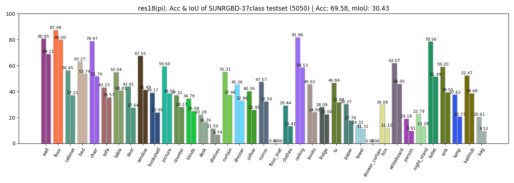
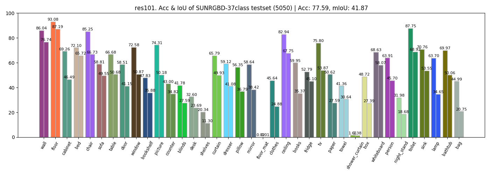

# BiSeNet-wali

Compress BiSeNet with Structure Knowledge Distillation for Real-time image segmentation on wali-TX2.

This repo is developed for RGB image. BiSeNet-RGBD architure can be accessed [here](https://github.com/Shuai-Xie/Wali-turtlebot).


Reference:

- BiSeNet (ECCV2018): https://github.com/ooooverflow/BiSeNet
- Structure Knowledge Distillation (CVPR2019_oral): https://github.com/irfanICMLL/structure_knowledge_distillation






## BiSeNet [arch + CP in_planes] 基本模型在 CPU/GPU/TX2 推理时间

- SP: Spatial Path, CP: Context Path
- 保持 SP = 128 chans，CP 通过调整 `in_planes` 尝试不同的大小模型
- 速度
  - CPU 上的速度，忠诚于 in_planes 变动
  - GPU 上负载少时，infer 更快，FPS 更高
- BiSeNet 结构 快的原因
  - 去掉了 U 型结构中 太多 深浅层关联的桥接; 浅层细节完全交给 SP 完成
  - 明确提出 浅层细节 SP 和 深层语义 CP 的 **双边**分割


arch | CP in_planes | valid_IoU | valid_Acc | test_IoU | test_Acc | CPU | GPU | TX2 | TRT
:-:| :-:| :-:|:-:|:-:|:-: | :-: | :-: | :-: | :-: 
res18(up) | 64  | 47.23 | 81.77 | 35.07  | 74.36 | 5.3 | 63.5 | / | /
res50 | 64  | 50.26 | 83.41 | 38.64  | 76.60 | 2.1 | 27.2 | / | /
res101 | 64 | 52.00 | 84.73 | 41.04  | 78.02 | 1.8 | 18.0 | / | /
res18(deconv) | 64  |  | | | | 5.4 | 54.9 |7.8
res50 | 64  |  | | |  | 1.8 | 12.1 | 1.8
res101 | 64 | **58.38** | **85.16** | 41.87 | 77.59 | 1.3 | 9.7 | 1.5
res18 | 32  | 38.08 | 73.94 | **28.75** | **67.26** | 9.8 | 130.3 | **24.5** |
res50 | 32  |  |  |  | | 4.5 | 35.0 | 5.9
res101 | 32 |  |  |  | | 3.4 | 26.1 | 4.7
res18 | 16  |  |  | | | 17.2 | 202.7 | 51.2
res50 | 16  | 34.70 | 71.11 | 26.49 | 64.61 | 8.6 | 80.0 | 15.1
res101 | 16 |  |  |  | | 6.3 | 61.5 | 12.1

注：只有前3组实验上采样使用 upsample, 因为 TX2 torch 不支持 upsample，之后实验都为 deconv
- **res18, inp=32, IoU & Speed 双优，作为 student 模型**
- **res101, inp=64, 作为 teacher 模型**
- 训练 iteration = 40000


## 减少 SP=64 chans, 性能大幅下降 [×]

test_IoU 平均下降 2+ 个点，valid_IoU 平均下降 4+ 个点；**不能再用这种方式压缩模型**

arch |SP| CP in_planes | valid_IoU | valid_Acc | test_IoU | test_Acc | CPU | GPU | TX2 |
:-:| :-:| :-:| :-:|:-:|:-:|:-: | :-: | :-: | :-:
res18 | 128 | 32  | 38.08 | 73.94 | **28.75** | **67.26** | 9.8 | 130.3 | 24.5 |
res18 | 64 | 32  | 33.30 | 70.63 | 26.00 | 64.35 | 9.8 | 292.8 | **33.0**
res50 | 128 | 16  | 34.70 | 71.11 | **26.49** | 64.61 | 8.6 | 80.0 | 15.1
res50 | 64 | 16  | 30.23 | 69.27 | 24.73 | 63.79 | 8.6 | 160.4 | **18.8**

## After Distillation [√]
- pi: pixel-wise; pa: pair-wise; ho: holistic

arch | in_planes | valid_IoU | valid_Acc | test_IoU | test_Acc | note
:-:| :-: | :-:| :-:|:-:|:-:|-
res101 | 64  | **58.38** | **85.16** | 41.87 | 77.59 | Teacher
res18 | 32  | 38.08 | 73.94 | **28.75** | 67.26 | base
res18 (pi) | 32  | 39.45 | 75.43 | 29.30 | 68.52 | lr=1e-4, pi=10
res18 (pi) | 32  | 39.86 | 75.99 | **30.43** | 69.58 | lr=1e-3, pi=10
res18 (pi) | 32  | 38.18 | 75.27 | 30.02 | 69.48 | lr=5e-3, pi=10
res18 (pa) | 32  | 38.51 | 74.25 | 28.20 | 66.87 | lr=1e-3, pa=10
res18 (pi+pa) | 32  | 39.76 | 75.90 | 30.07 | 69.28 | lr=1e-3, pi=10, pa=10

- +pi: 1e-4 的 pi_loss 近似保持横线，1e-3 看到 pi_loss 有明显下降，5e-3 性能略有下降
- 不完全是个 finetune 过程，soft_label 的学习，也需要恰当的 lr
- 训练 iteration = 10000
- **pa_loss 为 cos 余弦距离，本身数量级小，强行添加权值到 seg_loss 同等规模，会带来各种 loss 的剧增**
- pa_loss 本质上为 feature 内部相似性度量，类似 self-attention；**实验结果并未带来蒸馏性能提升**

## convert to ONNX

- [Pytroch 上采样 -> ONNX](onnx/torch2onnx.md)

## Inference Speed on Various Devices

CPU infer

```py
# arch - inplanes
resnet18 - 16 	 time: 0.05347979068756103 	 fps: 18.698652091631914
resnet18 - 32 	 time: 0.10354204177856445 	 fps: 9.65791269732352
resnet18 - 64 	 time: 0.18792753219604490 	 fps: 5.321200083427934

resnet50 - 16 	 time: 0.11204280853271484 	 fps: 8.925160062441801
resnet50 - 32 	 time: 0.22045552730560303 	 fps: 4.53606227170601
resnet50 - 64 	 time: 0.47310781478881836 	 fps: 2.113683115647479

resnet101 - 16 	 time: 0.14643387794494628 	 fps: 6.829020811536269
resnet101 - 32 	 time: 0.25973417758941650 	 fps: 3.8500901547919635
resnet101 - 64 	 time: 0.57127020359039300 	 fps: 1.7504851359568034

# deconv 差别不大，略有下降
resnet18 - 16 	 time: 0.05818810462951660 	 fps: 17.1856431201359
resnet18 - 32 	 time: 0.10182969570159912 	 fps: 9.820318062526589
resnet18 - 64 	 time: 0.18533535003662110 	 fps: 5.395624740786937

resnet50 - 16 	 time: 0.11621274948120117 	 fps: 8.604907847583128
resnet50 - 32 	 time: 0.22408280372619630 	 fps: 4.462636058507579
resnet50 - 64 	 time: 0.55882019996643060 	 fps: 1.7894843458773892

resnet101 - 16 	 time: 0.15813012123107910 	 fps: 6.323905858129821
resnet101 - 32 	 time: 0.29029526710510256 	 fps: 3.4447685281687557
resnet101 - 64 	 time: 0.74392204284667970 	 fps: 1.3442268711025374
```

GPU infer

```py
# arch - inplanes
resnet18 - 16 	 time: 0.004689335823059082 	 fps: 213.24981569514705
resnet18 - 32 	 time: 0.007193267345428467 	 fps: 139.01888418418503
resnet18 - 64 	 time: 0.015751779079437256 	 fps: 63.484892402117524

resnet50 - 16 	 time: 0.009638953208923340 	 fps: 103.74570540235032
resnet50 - 32 	 time: 0.014894998073577880 	 fps: 67.13663171087562
resnet50 - 64 	 time: 0.036808860301971430 	 fps: 27.167371980447907

resnet101 - 16 	 time: 0.012390828132629395 	 fps: 80.70485598671564
resnet101 - 32 	 time: 0.026305425167083740 	 fps: 38.014971955340634
resnet101 - 64 	 time: 0.055841803550720215 	 fps: 17.90773106194029

# gpu + deconv 比直接 upsample 稍慢
resnet18 - 16 	 time: 0.0049323558807373045 	 fps: 202.74287261091078
resnet18 - 32 	 time: 0.0076752901077270510 	 fps: 130.28823483730682
resnet18 - 64 	 time: 0.0182011842727661140 	 fps: 54.941479906682225

resnet50 - 16 	 time: 0.012502193450927734 	 fps: 79.98596437697853
resnet50 - 32 	 time: 0.028601193428039552 	 fps: 34.96357599608543
resnet50 - 64 	 time: 0.082448863983154290 	 fps: 12.128729878004348

resnet101 - 16 	 time: 0.016249334812164305 	 fps: 61.54098069610805
resnet101 - 32 	 time: 0.038253283500671385 	 fps: 26.141546776826335
resnet101 - 64 	 time: 0.102581226825714100 	 fps: 9.748372396627735

# cpu upsample, 部分操作转移到 CPU，速度更慢了
resnet18 - 16 	 time: 0.03870357275009155 	 fps: 25.837407994786076
resnet18 - 32 	 time: 0.07058500051498413 	 fps: 14.167315898619496
resnet18 - 64 	 time: 0.14476600885391236 	 fps: 6.907698899187927

resnet50 - 16 	 time: 0.13139193058013915 	 fps: 7.610817464852421
resnet50 - 32 	 time: 0.27268123626708984 	 fps: 3.667285705792038
resnet50 - 64 	 time: 0.62760386466979980 	 fps: 1.5933617625604144

resnet101 - 16 	 time: 0.1334829092025757 	 fps: 7.491595785362939
resnet101 - 32 	 time: 0.2804239988327026 	 fps: 3.5660286001291466
resnet101 - 64 	 time: 0.6410346508026123 	 fps: 1.5599780741149365
```

TX2 infer

```py
# cpu
resnet18 - 16 	 time: 0.4392608404159546 	 fps: 2.276551670422198
resnet18 - 32 	 time: 1.0016891717910767 	 fps: 0.9983136766986744
resnet18 - 64 	 time: 2.234201192855835 	 fps: 0.4475872643867693

resnet50 - 16 	 time: 0.8117639303207398 	 fps: 1.231885234916616
resnet50 - 32 	 time: 2.240462875366211 	 fps: 0.4463363401353154
resnet50 - 64 	 time: 5.18095223903656 	 fps: 0.19301471116938113

resnet101 - 16 	 time: 1.4539900541305542 	 fps: 0.6877626137532091
resnet101 - 32 	 time: 3.2897871494293214 	 fps: 0.3039710335586513
resnet101 - 64 	 time: 7.119290184974671 	 fps: 0.14046344144118603

# gpu + deconv
resnet18 - 16 	 time: 0.01954698562622070 	 fps: 51.158783206888984
resnet18 - 32 	 time: 0.04074519872665405 	 fps: 24.5427689949107    # 1
resnet18 - 64 	 time: 0.1278276562690735 	 fps: 7.82303320883103

resnet50 - 16 	 time: 0.06625185012817383 	 fps: 15.093918102896065  # 2
resnet50 - 32 	 time: 0.17058074474334717 	 fps: 5.862326381002631
resnet50 - 64 	 time: 0.5573523283004761 	 fps: 1.7941972235933437

resnet101 - 16 	 time: 0.08274534940719605 	 fps: 12.085271343515938
resnet101 - 32 	 time: 0.21335372924804688 	 fps: 4.687051890418992
resnet101 - 64 	 time: 0.6515600681304932 	 fps: 1.5347779106065813


# gpu + cpu upsample
# sudo nvpmodel -m 0, 已是最大功率情况下
resnet18 - 16 	 time: 0.10670669078826904 	 fps: 9.3714835743921
resnet18 - 32 	 time: 0.23019177913665773 	 fps: 4.344203792813691
resnet18 - 64 	 time: 0.4999691009521484 	 fps: 2.0001236038298877

resnet50 - 16 	 time: 0.39669969081878664 	 fps: 2.5207985363840435
resnet50 - 32 	 time: 0.8320304155349731 	 fps: 1.20187913966706
resnet50 - 64 	 time: 2.0053189754486085 	 fps: 0.4986737831951601

resnet101 - 16 	 time: 0.4652644872665405 	 fps: 2.1493151258439385
resnet101 - 32 	 time: 0.8607745170593262 	 fps: 1.1617444292104644
resnet101 - 64 	 time: 2.0529680490493774 	 fps: 0.48709964115761467
```

## DeepLabv3+ on TX2

```py
mobilenet 	 time: 0.2479145646095276 	 fps: 4.033647646216462
resnet50 	 time: 0.3126360774040222 	 fps: 3.1986071738857307
resnet101 	 time: 0.41015373468399047 	 fps: 2.438110190000991
```